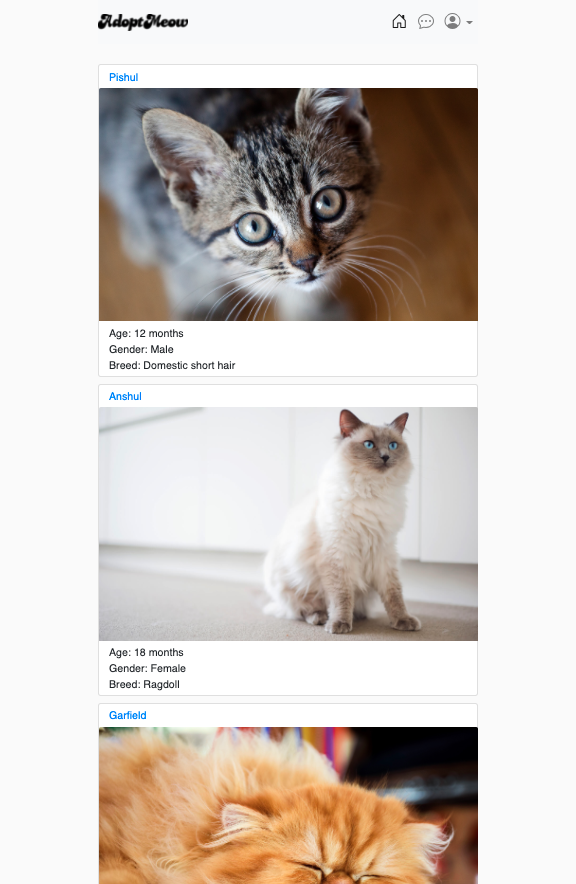

# AdoptMeow

## Description

AdoptMeow is a platform for cat lovers to list or browse cats for adoption.

It is a full CRUD system that uses an MVC architecture with Active Record on Rails as the Model.

In this project, I gained a great experience working with PostgreSQL RDBMS as well as full setup of Amazon S3 bucket for storing images of the users and their cats.

Live demo: [AdoptMeow](https://adoptme-project-hessam.herokuapp.com/).




## Technologies

Technologies that has been utilised for developing AdoptMeow are:

- Ruby on Rails
- PostgreSQL
- Active Storage
- AWS S3
- Heroku

## How to use

After creating an account and signing in, users get a chance to browse cats that have been listed by other users for adoption through getting in touch with the owner of the cat via a simple in-app messaging system.

Each user has a profile that can go to, edit, and upload their photo, as well as a link to list a cat for adoption.

## Instructions to run code

After cloning the code on your local directory, run the following command:

```
# To install all gem files
bundle install
```
then:

```
# To create database
rails db:create

# To migrate data and create schema
rails db:migrate

# To seed some pre-filled data
rails db:seed
```

Then run the server on http://localhost:3000/ with following command:

```
rails server
```


## System dependencies

* Ruby version 2.7.4
* PostgreSQL RDBMS
* Heroku for deployment

## Services

The app uses AWS S3 bucket as a cloud storage system for uploading/editing both users and cats photos.

## Deployment instructions

First, create an account in Heroku following this link https://devcenter.heroku.com/articles/creating-apps

Then use the following commands in CLI to run your app on Heroku:

```
heroku run rails db:migrate
heroku run db:seed
heroku open
```

For debugging, Heroku logs can be used using the below command in CLI:

```
heroku logs --tail
```

## Roadmap for future development

- Messaging system: For users to directly message the owners about their listed cats
- UI improvements
